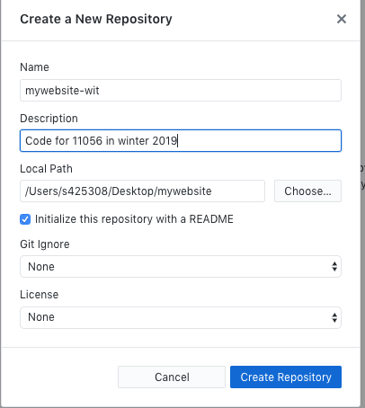

# GitHub

## Introduction
- Signing up to GitHub
- GitHub desktop
- Pushing the repo

## Signing up to GitHub

If you haven't already, you need to sign up to GitHub

Go here: [https://github.com/join](https://github.com/join)

!!! warning
    Don't use your student ID as your username. 
    

## Download GitHub Desktop

Once you've signed up, download GitHub Desktop: [https://desktop.github.com/](https://desktop.github.com/)

- It's a free for both Mac and PC
- It will allow you to easily push your work to GitHub

## Getting started

<!--
You should already have created your site folder on your computer. 
If not, head back to [Site Setup](html-2/) and follow the steps.
-->

!!! info
    **TL;DR**
    Basically, create a folder on your computer to hold all your website files. In this folder, make a new folder called 'assets', in the assets folder make 2 extra folders, call them: 'images' and 'css'. **All in lowercase, no spaces.** 
    

### Create a repository

Three ways:

- From GitHub.com
- From GitHub Desktop
- From Command Line

We'll do it from GitHub Desktop.

!!! tip 
    A repository is often referred to as a 'repo' 

### GitHub Desktop

1. Open GitHub Desktop
2. Click `File` > `New Repository` 
3. In the form that appears, fill in the following:

**Name:** *give your project a name* e.g. mywebsite

**Description:** *brief desciption* e.g website files for 11056 in winter 2019

**Local Path:** *this is where the folder is saved on your computer.* Choose a location - do not move the folder afterwards

**Initialize this repo:** Tick Initialize this repo with a README

**Git Ignore:** NONE

**License:** NONE

Now click `Create Repository`

Go to the location where you said to create the repo and you should see the folder appear. 

Great, now move onto site setup!